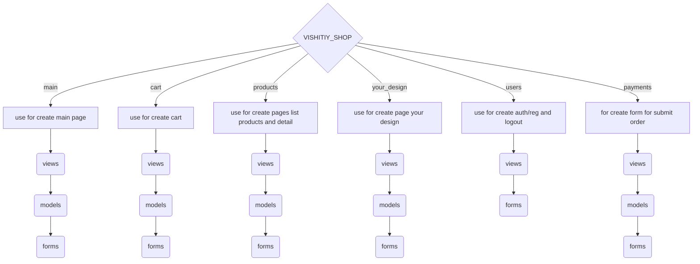

# Vishitiy.ua - project

_Our project is a online store for selling clothes_

---

## How use it ?

1. >git clone https://github.com/danilgubarev/vishitiy_shop.git
2. >pip install -r requirements.txt
3. >npm install
4. >npm run dev
5. >python manage.py runserver

---

```
graph TD

  B --> C{VISHITIY_SHOP}
  C -->|main| D[views, modules, forms]
  C -->|cart| E[views, modules, forms]
  C -->|products| f[views, modules, forms] --> 1(views) --> 2(modules) --> q(forms)
  C -->|your_design| e[views, modules, forms] --> k(views) --> j(modules) --> h(forms)
  C -->|users| F[views, modules, forms] --> r(views) --> t(modules) --> o(forms)

```
---

## Information about our team
1. GitHub - [Danil](https://github.com/danilgubarev)
2. GitHub - [Olha](https://github.com/Olhabd)
3. GitHub - [Oleksii](https://github.com/AlexeyTarasov77)
4. GitHub - [Vitalii](https://github.com/IWaithI)

---

1. Figma - [Danil](https://www.figma.com/design/kITnzVDamIAVnLsSdZr3VM/vishitiy?node-id=0-1&t=gEzSZBI2PThBR6iK-1)
2. Figma - [Olha](https://www.figma.com/design/kITnzVDamIAVnLsSdZr3VM/vishitiy?t=YzVNAU0GbcKXdTTA-0)
3. Figma - [Oleksii](https://www.figma.com/design/TfGbzNcv8RlRhQKjstFQ0e/Design?node-id=0-1&t=9oRZAN8ghNfeRUgZ-1)
4. Figma - [Vitalii](https://www.figma.com/design/v19cj5mrLwEPN9hKKdGXYQ/Untitled?node-id=0-1&t=9zSuZg68wKwLJrJa-1)


---

# Our project structure


---


## Technologies and languages we used
1. >Python/Django - We used Python and Django for rapid development of web applications.
2. >JavaScript -  We used JavaScript for managing the item counter, displaying popup notifications, and interacting with the shopping cart.
3. >HTML - We used HTML for structuring our website.
4. >CSS - We used CSS for styling our website.
5. >MySQL - We use MySQL to store various data about products and users.
6. >sqlite3 - We used sqlite3 to store various data about products and users.
6. >Bootstrap - We used Bootstrap for its classes and templates, as well as for implementing responsiveness.
7. >Figma - We used Figma for creating the design of our website.   
8. >jQuery/Ajax - We use jQuery/Ajax to prevent full page reload when submitting a form or adding an item to the cart.


## Libraries we used

```txt

asgiref==3.8.1
# Library for ASGI reference implementation, necessary for Django's async support
# Бібліотека для реалізації ASGI, необхідна для асинхронної підтримки Django

crispy-bootstrap5==2024.2
# Library for Django compatibility with Bootstrap5, simplifies the creation of forms using Bootstrap5
# Бібліотека для сумісності Django з Bootstrap5, спрощує створення форм з використанням Bootstrap5

Django==5.0.6
# Framework for building web applications
# Фреймворк для створення веб-застосунків

django-crispy-forms==2.1
# Django application that helps create beautiful forms
# Застосунок Django, який допомагає створювати гарні форми

sqlparse==0.5.0
# Parser for working with SQL databases
# Парсер для роботи з базами даних SQL

Pillow==10.3.0
# Library for working with images
# Бібліотека для роботи з зображеннями

django-colorfield==0.11.0
# Library used to add "color picker or color fields" in Django models
# Бібліотека, що використовується для додавання "вибору кольору або кольорових полів" у моделях Django

django-filter==24.2
# Library that allows easy creation of filters for data in applications
# Бібліотека, яка дозволяє легко створювати фільтри для даних у застосунках

mysqlclient==2.2.4
# Used by Django for connecting to and working with databases
# Використовується Django для підключення та роботи з базами даних

faker==25.8.0
# Library for generating fake data
# Бібліотека для генерації фальшивих даних

python-dateutil==2.9.0.post0
# Library for working with dates and times
# Бібліотека для роботи з датами та часом

six==1.16.0
# Utility library for supporting code that works on both Python 2 and Python 3
# Бібліотека для підтримки коду, який працює як на Python 2, так і на Python 3

python-dotenv==1.0.1
# Library for loading environment variables from a .env file
# Бібліотека для завантаження змінних середовища з файлу .env
# Reads key-value pairs from a .env file and can set them as environment variables
# Зчитує ключ-значення з файлу .env і може встановлювати їх як змінні середовища
# (Used in the project to store confidential data)
# (У нашому проєкті використовується для зберігання конфіденційних даних)

algoliasearch==3.0.0
# Official Algolia client library for Python, used for interacting with Algolia search systems
# Офіційна бібліотека клієнта Algolia для Python, використовується для взаємодії з пошуковими системами Algolia

algoliasearch-django==3.0.0
# Library for integrating Algolia with Django
# Бібліотека для інтеграції Algolia з Django

certifi==2024.6.2
# Python package for providing Mozilla's CA Bundle
# Пакет Python для надання CA Bundle від Mozilla

charset-normalizer==3.3.2
# Library that helps you read text from unknown encoding
# Бібліотека, яка допомагає читати текст з невідомого кодування

idna==3.7
# Used for handling internationalized domain names (IDNs)
# Використовується для роботи з URL-адресами, що містять не-ASCII символи

requests==2.32.3
# Library used for making HTTP requests
# Бібліотека, що використовується для виконання HTTP-запитів

urllib3==2.2.1
# HTTP client library
# Бібліотека для роботи з HTTP

django-countries==7.6.1
# Django library that provides a country field for models and forms
# Бібліотека Django, яка дозволяє використовувати список країн у моделях і формах

typing-extensions==4.12.2
# Backported and experimental type hints for Python
# Пакет із додатковими анотаціями типів для Python

```

---

# USERS APP:

---

### VIEWS.PY

1. __functions for registration login and logout:__

```python
User = get_user_model()  # Getting the user model using the get_user_model function / Отримуємо модель користувача за допомогою функції get_user_model

# View function for registering a new user / Функція представлення для реєстрації нового користувача
def signup_view(request):
    form = UserCreationForm()  # Creating an instance of the standard UserCreationForm for user registration / Створюємо екземпляр стандартної форми UserCreationForm для реєстрації користувача
    if request.method == "POST":  # If the request method is POST / Якщо запит методу POST
       form = UserCreationForm(request.POST)  # Using POST data to create the UserCreationForm / Використовуємо дані POST для створення форми UserCreationForm
       if form.is_valid():  # If the form data is valid / Якщо дані форми пройшли валідацію
           form.save()  # Saving the user / Зберігаємо користувача
           messages.success(request, "Account successfully created")  # Sending a success message about the account creation / Відправляємо повідомлення про успішне створення облікового запису
           return redirect("users:login")  # Redirecting the user to the login page / Перенаправляємо користувача на сторінку входу
    return render(request, "registration/signup.html", {"form": form})  # Displaying the signup.html template with the user registration form / Відображаємо шаблон signup.html з формою для реєстрації користувача

# View function for user login / Функція представлення для входу користувача
def login_view(request):
    form = AuthenticationForm()  # Creating an instance of the standard AuthenticationForm for user login / Створюємо екземпляр стандартної форми AuthenticationForm для входу користувача
    if request.method == "POST":  # If the request method is POST / Якщо запит методу POST
        form = AuthenticationForm(data=request.POST)  # Using POST data to create the AuthenticationForm / Використовуємо дані POST для створення форми AuthenticationForm
        if form.is_valid():  # If the form data is valid / Якщо дані форми пройшли валідацію
            user = form.get_user()  # Getting the user from the authentication form / Отримуємо користувача з форми аутентифікації
            messages.success(request, f"You are logged in as {user.username}")  # Sending a success message about the user's login / Відправляємо повідомлення про успішний вхід користувача
    return render(request, "registration/login.html", {"form": form})  # Displaying the login.html template with the login form / Відображаємо шаблон login.html з формою для входу користувача

# Class for handling user logout / Клас для обробки виходу користувача
class LogoutView(DjangoLogoutView):
    http_method_names = ["post", "options", "get"]  # Specifying allowed HTTP methods for this view / Вказуємо дозволені HTTP-методи для цього представлення
    def get(self, *args, **kwargs):  # Defining the GET method / Визначаємо метод GET
        if not self.request.user.is_authenticated:  # If the user is not authenticated / Якщо користувач не аутентифікований
            return redirect("users:login")  # Redirecting them to the login page / Перенаправляємо його на сторінку входу
        return render(self.request, "registration/logout.html")  # Displaying the logout.html template / Відображаємо шаблон logout.html

# Class for handling user login using Django's built-in LoginView / Клас для обробки входу користувача за допомогою вбудованого LoginView у Django
class LoginView(DjangoLoginView):
    redirect_authenticated_user = True  # Redirecting authenticated users / Перенаправлення аутентифікованих користувачів
    form_class = forms.CustomAuthenticationForm  # Using a custom authentication form CustomAuthenticationForm / Використовуємо спеціальну форму автентифікації CustomAuthenticationForm
    def form_valid(self, form):  # Overriding method to handle valid form submission / Перевизначення методу для обробки валідних даних форми
        messages.success(self.request, f"You are logged in as {form.get_user().username}")  # Sending a success message about the user's login / Відправляємо повідомлення про успішний вхід користувача
        return super().form_valid(form)  # Calling the parent method form_valid for form data saving / Викликаємо батьківський метод form_valid для збереження даних форми

# Class for user registration using generic CreateView / Клас для реєстрації користувача за допомогою загального представлення CreateView
class SignupView(generic.CreateView):
    form_class = forms.CustomUserCreationForm  # Using a custom registration form CustomUserCreationForm / Використовуємо спеціальну форму реєстрації CustomUserCreationForm
    success_url = reverse_lazy("users:login")  # Redirecting the user to the login page after successful registration / Перенаправлення користувача на сторінку входу після успішної реєстрації
    template_name = "registration/signup.html"  # Specifying the template name for displaying the registration form / Вказуємо ім'я шаблону для відображення форми реєстрації
    def form_valid(self, form):  # Overriding method to handle valid form submission / Перевизначення методу для обробки валідних даних форми
        messages.success(self.request, "Account successfully created")  # Sending a success message about the account registration / Відправляємо повідомлення про успішну реєстрацію облікового запису
        return super().form_valid(form)  # Calling the parent method form_valid to save form data / Викликаємо батьківський метод form_valid для збереження даних форми


```
_This code contains views for user login and logout functionalities. We used standard Django forms, as well as custom forms located in the forms.py file./Цей код містить представлення для входу та виходу користувача. Ми використовували стандартні форми Django, а також кастомні форми, які знаходяться у файлі forms.py._

### FORMS.PY

2.__Creat customs forms:__

```python

# Creating a custom authentication form inheriting from Django's standard forms
class CustomAuthenticationForm(AuthenticationForm):
    def __init__(self, *args, **kwargs):
        # Calling the parent constructor to initialize the form / Виклик батьківського конструктора для ініціалізації форми
        super().__init__(*args, **kwargs)
        # If 'password' field is present in form data ('self.data') / Якщо поле 'password' є в даних форми ('self.data')
        if 'password' in self.data:
            # Setting the 'value' attribute of the password field widget to the value from form data / Встановлення атрибуту 'value' віджета поля пароля на значення з даних форми
            self.fields['password'].widget.attrs['value'] = self.data['password']

# Creating a custom user creation form inheriting from Django's standard UserCreationForm / Створення власної форми створення користувача, що успадковується від стандартної UserCreationForm Django
class CustomUserCreationForm(UserCreationForm):
    def __init__(self, *args, **kwargs):
        # Calling the parent constructor to initialize the form / Виклик батьківського конструктора для ініціалізації форми
        super().__init__(*args, **kwargs)
        # If 'password1' field is present in form data ('self.data') / Якщо поле 'password1' є в даних форми ('self.data')
        if 'password1' in self.data:
            # Setting the 'value' attribute of the 'password1' field widget to the value from form data / Встановлення атрибуту 'value' віджета поля 'password1' на значення з даних форми
            self.fields['password1'].widget.attrs['value'] = self.data['password1']
        # If 'password2' field is present in form data ('self.data') / Якщо поле 'password2' є в даних форми ('self.data')
        if 'password2' in self.data:
            # Setting the 'value' attribute of the 'password2' field widget to the value from form data / Встановлення атрибуту 'value' віджета поля 'password2' на значення з даних форми
            self.fields['password2'].widget.attrs['value'] = self.data['password2']


```

_These custom forms allow saving user-entered passwords even when the page is refreshed./Ці кастомні форми дозволяють зберігати введені користувачем паролі навіть при перезавантаженні сторінки._

---

# PRODUCTS APP

---

### VIEWS.PY

1. __Displaying a list of products, as well as product details (personal product page)__

```python 

class ProductListView(generic.ListView):
    # Here we specify the template to be used for displaying the list of products / Тут ми вказуємо шаблон, який буде використовуватись для відображення списку продуктів
    template_name = 'products/product_list.html'
    # Set the queryset to retrieve all Product objects and use select_related for query optimization / Встановлюємо queryset для отримання всіх об'єктів Product і використання select_related для оптимізації запитів
    queryset = Product.objects.all().select_related("collection")

    # Method to get the queryset / Метод для отримання queryset
    def get_queryset(self) -> QuerySet[Product]:
        # Call get_queryset from the parent class to get the base queryset / Викликаємо get_queryset з батьківського класу, щоб отримати базовий queryset
        qs = super().get_queryset()
        # Create an instance of the filter, passing GET request parameters and the base queryset / Створюємо екземпляр фільтра, передаючи параметри GET запиту і базовий queryset
        self.filterset = ProductFilter(self.request.GET, queryset=qs)
        # Return the filtered queryset / Повертаємо відфільтрований queryset
        return self.filterset.qs
    
    # Method to get the context data that will be passed to the template / Метод для отримання контекстних даних, які будуть передані в шаблон
    def get_context_data(self, **kwargs: Any) -> dict[str, Any]:
        # Get the base context from the parent class / Отримуємо базовий контекст з батьківського класу
        context = super().get_context_data(**kwargs)
        # Add the filter form to the context / Додаємо форму фільтра до контексту
        context["form"] = self.filterset.form
        # Return the context / Повертаємо контекст
        return context


class ProductDetailView(generic.DetailView):
    # Set the queryset to retrieve all Product objects and use select_related for query optimization / Встановлюємо queryset для отримання всіх об'єктів Product і використання select_related для оптимізації запитів
    queryset = Product.objects.all().select_related("collection")
    # Specify the template to be used for displaying the product details / Вказуємо шаблон, який буде використовуватись для відображення деталей продукту
    template_name = "products/product_detail.html"


```


* ProductListView - відображає весь список продуктів з використанням фільтрації.
* ProductDetailView - відображає особисту сторінку товару.

_Ці класи використовуються у Django для керування видами: generic.ListView для відображення списку об'єктів моделі і generic.DetailView для відображення детальної інформації про продукт (сторінка індивідуального продукту)._

* generic.ListView - використовується для відображення списку об'єктів моделі у Django.
* generic.DetailView - використовується для відображення детальної інформації про конкретний продукт (особиста сторінка продукту).


### MODELS.PY

2. Creating Product and Collection Models

```python
class Product(SaveSlugMixin, models.Model):
    # Define the Product model inheriting from SaveSlugMixin and models.Model / Визначення моделі Product, що успадковує SaveSlugMixin та models.Model
    ACCEPTABLE_SIZES = ["XS", "S", "M", "L", "XL", "XXL"]  
    # Допустимі розміри продукту
    SIZE_CHOICES = tuple((size, size) for size in ACCEPTABLE_SIZES)  
    # Створюємо кортеж з варіантами розмірів для вибору
    COLOR_PALETTE = tuple((color, color) for color in ("white", "black", "red", "green", "blue", "yellow"))  
    # Кольорова палітра
    PRODUCT_TYPE_CHOICES = tuple(
        (type, type)
        for type in ("shoes", "t-shirt", "sweatshirt", "pants", "jacket", "sunglasses")  # Варіанти типів продуктів
    )
    
    SIZE_VALIDATOR = ProductSizeValidator(ACCEPTABLE_SIZES)  
    # Створюємо екземпляр валідатора розмірів
    
    title = models.CharField(max_length=150)  
    # Поле для назви продукту
    slug = models.SlugField(unique=True, blank=True)  
    # Поле для slug, унікальне і може бути пустим
    available_colors = models.JSONField(default=list)  
    # Поле для доступних кольорів, використовується JSON
    available_sizes = models.JSONField(default=list, validators=[SIZE_VALIDATOR.validate_size])  
    # Поле для доступних розмірів, використовується JSON з валідатором
    available = models.BooleanField(default=True)  
    # Поле для статусу доступності продукту
    type = models.CharField(choices=PRODUCT_TYPE_CHOICES, max_length=50)  
    # Поле для типу продукту з обмеженим вибором
    image = models.ImageField()  
    # Поле для зображення продукту
    description = models.TextField(blank=True, null=True)  
    # Поле для опису продукту, може бути пустим або null
    price = models.DecimalField(max_digits=10, decimal_places=2)  
    # Поле для ціни продукту
    discount = models.IntegerField(
        default=0,
        validators=[MinValueValidator(0), MaxValueValidator(100)]  
        # Поле для знижки з валідаторами мінімального та максимального значення
    )
    collection = models.ForeignKey(
        "Collection", on_delete=models.CASCADE, related_name="products"  
        # Поле зовнішнього ключа, зв'язує продукт з колекцією
    )

    def __str__(self) -> str:
        return self.title  
    # Метод для рядкового представлення об'єкта
    
    @property
    def image_url(self):
        return self.image.url  
    # Властивість для отримання URL зображення
    
    @property
    def final_price(self):
        return self.price - (self.price * self.discount / 100)  
    # Властивість для обчислення кінцевої ціни з урахуванням знижки

    @property
    def url(self):
        return self.get_absolute_url()  
    # Властивість для отримання абсолютного URL продукту
    
    def get_absolute_url(self):
        return reverse("products:detail", kwargs={"slug": self.slug})  
    # Метод для отримання абсолютного URL продукту
    
    def save(self, *args, **kwargs) -> None:
        return super().save(slugify_value=self.title, *args, **kwargs)  
    # Метод для збереження об'єкта з автоматичним генеруванням slug

class Collection(SaveSlugMixin, models.Model):
    # Define the Collection model inheriting from SaveSlugMixin and models.Model / Визначення моделі Collection, що успадковує SaveSlugMixin та models.Model
    name = models.CharField(max_length=150)  
    # Поле для назви колекції
    slug = models.SlugField(unique=True, blank=True)  
    # Поле для slug, унікальне і може бути пустим
    image = models.ImageField()  
    # Поле для зображення колекції
    description = models.TextField(blank=True, null=True)  
    # Поле для опису колекції, може бути пустим або null

    def __str__(self) -> str:
        return self.name  
    # Метод для рядкового представлення об'єкта

    def save(self, *args, **kwargs) -> None:
        return super().save(slugify_value=self.name, *args, **kwargs)  
    # Метод для збереження об'єкта з автоматичним генеруванням slug


```

_This code is used to work with Collections and Products, providing convenient methods for accessing, saving, and linking data in the database./Цей код використовується для роботи з Колекціями та Товарами, забезпечуючи зручні методи доступу, збереження та зв'язування даних в базі даних._

* @property - representing a method as an object property./ дозволяє представляти метод як властивість об'єкта.


### FILTERS.PY


3. Filtering data on a page

```python

# Define the filter class for the Product model / Визначення класу фільтра для моделі Product
class ProductFilter(django_filters.FilterSet):
    # Price filter using a custom range widget / Фільтр ціни з використанням власного виджету діапазону цін
    price = django_filters.RangeFilter(widget=CustomRangeWidget(attrs={'class': 'px-3 py-2 border border-gray-200 rounded w-24 text-center'}))
    
    # Size filter using a multiple choice widget with checkboxes / Фільтр розміру з використанням віджета множинного вибору з прапорцями
    size = django_filters.TypedMultipleChoiceFilter(
        field_name="available_sizes",  # Model field for filtering / Поле моделі для фільтрації
        choices=Product.SIZE_CHOICES,  # Available size options / Доступні варіанти розмірів
        widget=forms.CheckboxSelectMultiple,  # Widget to display options as checkboxes / Віджет для відображення варіантів у вигляді прапорців
        lookup_expr='icontains'  # Lookup expression (case-insensitive substring search) / Вираз пошуку (пошук підстроки без урахування регістру)
    )
    
    # Collection filter using a multiple choice widget with checkboxes / Фільтр колекції з використанням віджета множинного вибору з прапорцями
    collection = django_filters.ModelMultipleChoiceFilter(
        queryset=Collection.objects.all(),  # All collection objects / Усі об'єкти колекції
        widget=forms.CheckboxSelectMultiple  # Widget to display options as checkboxes / Віджет для відображення варіантів у вигляді прапорців
    )
    
    # Color filter using a multiple choice widget with checkboxes / Фільтр кольору з використанням віджета множинного вибору з прапорцями
    color = django_filters.TypedMultipleChoiceFilter(
        field_name='available_colors',  # Model field for filtering / Поле моделі для фільтрації
        choices=Product.COLOR_PALETTE,  # Available color options / Доступні варіанти кольорів
        widget=forms.CheckboxSelectMultiple,  # Widget to display options as checkboxes / Віджет для відображення варіантів у вигляді прапорців
        lookup_expr='icontains'  # Lookup expression (case-insensitive substring search) / Вираз пошуку (пошук підстроки без урахування регістру)
    )
    
    # Filter to display only discounted products using a checkbox widget / Фільтр для відображення лише продуктів із знижкою з використанням віджета прапорця
    discounted_only = django_filters.BooleanFilter(
        field_name="discount",  # Model field for filtering / Поле моделі для фільтрації
        label="Discounted only",  # Filter label / Мітка фільтра
        widget=forms.CheckboxInput,  # Widget to display as checkbox / Віджет для відображення у вигляді прапорця
        method='filter_discounted_only'  # Method to filter / Метод для фільтрації
    )
    
    # Filtering method to return only discounted products when the checkbox is selected / Метод фільтрації, що повертає лише продукти із знижкою, якщо вибрано прапорець
    def filter_discounted_only(self, queryset, name, value):
        if value:  # If the checkbox is selected / Якщо вибрано прапорець
            return queryset.filter(discount__gt=0)  # Return products with non-zero discount / Повертаємо продукти з ненульовою знижкою
        return queryset  # Otherwise, return all products / В іншому випадку повертаємо всі продукти

    # Meta class to specify the model and fields used for filtering / Метаклас для вказівки моделі та полів, які використовуються для фільтрації
    class Meta:
        model = Product  # Specify the model for which the filter is created / Вказуємо модель, для якої створюється фільтр
        fields = ["price", "discounted_only", "type", "size", "color", "collection"]  # Fields of the model used for filtering / Поля моделі, які використовуються для фільтрації


```

_This code performs filtering on the page based on various parameters such as price, product type, size, color, collection, etc./Цей код здійснює фільтрацію на сторінці за різними параметрами, такими як ціна, тип продукту, розмір, колір, колекція і т. д._

___

### ADMIN.PY

3. Customization of the admin panel

```python
# Register the Collection model in the admin panel / Реєстрація моделі Collection у панелі адміністратора
admin.site.register(Collection)

# Register the Product model using a custom ProductAdmin class / Реєстрація моделі Product з використанням кастомного класу ProductAdmin
@admin.register(Product)
class ProductAdmin(admin.ModelAdmin):
    # Fields to display in the list of products in the admin panel / Поля, які будуть відображатися у списку продуктів у панелі адміністратора
    list_display = ["title", "final_price", "collection", "available"]
    
    # Override the get_form method to customize the product editing form / Перевизначення методу get_form для кастомізації форми редагування продукту
    def get_form(self, request, obj=None, **kwargs):
        # Get the base form for the Product model / Отримуємо базову форму для моделі Product
        form = super().get_form(request, obj, **kwargs)
        
        # Customize the widget for the available_sizes field / Кастомізація віджета для поля available_sizes
        form.base_fields['available_sizes'].widget = forms.CheckboxSelectMultiple(
            choices=Product.SIZE_CHOICES,  # Set the available size options / Встановлюємо доступні варіанти розмірів
            attrs={'class': 'form-control'},  # Add CSS class for styling / Додаємо CSS-клас для стилізації
        )
        
        # Customize the widget for the available_colors field / Кастомізація віджета для поля available_colors
        form.base_fields['available_colors'].widget = forms.CheckboxSelectMultiple(
            choices=Product.COLOR_PALETTE,  # Set the available color options / Встановлюємо доступні варіанти кольорів
            attrs={'class': 'form-control'}  # Add CSS class for styling / Додаємо CSS-клас для стилізації
        )
        
        # Return the customized form / Повертаємо кастомізовану форму
        return form


```


_Here's how this code is used to customize the admin panel./Ось як цей код використовується для налаштування адміністративної панелі._

* Here, the admin.register decorator is used to register the Product model and associate it with the custom ProductAdmin class, which inherits from admin.ModelAdmin. This approach allows customization of how the Product model is displayed and edited in the Django admin interface.

Тут використовується декоратор admin.register для реєстрації моделі Product і пов'язання її з кастомним класом ProductAdmin, який успадковує admin.ModelAdmin. Цей підхід дозволяє налаштовувати спосіб відображення та редагування моделі Product в адміністративному інтерфейсі Django.


